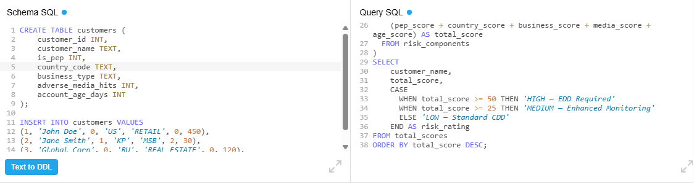

# KYC-Customer-Risk-Scoring

**1. Introduction**

In financial crime compliance, manual risk scoring often leads to inconsistent outcomes and "discretionary bias." This project addresses those vulnerabilities by codifying a **Risk-Based Approach (RBA)** directly into a technical framework. The model utilises **automated scoring logic** to evaluate customer profiles against fixed risk pillars, including **PEP status, Jurisdictional Risk,** and **Adverse Media.** By shifting the calculation from manual spreadsheets to a **SQL-driven engine,** the system ensures 100% computational consistency. This creates a reliable audit trail and ensures that **Enhanced Due Diligence (EDD)** triggers are based on objective data thresholds rather than subjective interpretation.

**2. Skills Demonstrated**

* **Domain Expertise:** Anti-Money Laundering (**AML**), Know Your Customer (**KYC**), Enhanced Due Diligence (**EDD**), PEP/Sanctions Screening.

* **Technical Skills:** **SQL** (Data Transformation & CASE logic), **Excel** (Conditional Formatting, **Nested IF Functions,** Data Validation).

* **Data Visualisation:** Designing executive-ready compliance reports.

**3. Key Features**

* **Automated Risk Tiering:** Instantly classifies customers into **High,** **Medium,** or **Low** risk.

* **Weighted Scoring Logic:** Not all risks are equal; this model weights "Country Risk" differently than "Product Risk."

* **EDD Trigger System:** Visual alerts (Red Flags) that notify the user when **Enhanced Due Diligence** is legally required.

* **Dynamic Dashboards:** Real-time recalculation of risk scores based on user input.

**4. Keyboard Shortcuts (Excel Utility)**

To speed up the investigative workflow within the tool:

* **Ctrl + Shift + L:** Quickly filter the risk output table.

* **Alt + A + C:** Clear all filters to see the full customer population.

* **F2:** Audit the underlying scoring formula in any cell.

**5. The Development Process**

* **Schema Design:** Defined the risk pillars (Geography, Customer Type, Product).

* **Logic Implementation:** Wrote CASE statements in SQL to assign numerical values to qualitative data.

* **Front-End Mapping:** Exported SQL results and built a VLOOKUP-driven dashboard in Excel for non-technical users.

 

**Schema (SQLite v3.46)**

    CREATE TABLE customers (
        customer_id INT,
        customer_name TEXT,
        is_pep INT,
        country_code TEXT,
        business_type TEXT,
        adverse_media_hits INT,
        account_age_days INT
    );
    
    INSERT INTO customers VALUES
    (1, 'John Doe', 0, 'US', 'RETAIL', 0, 450),
    (2, 'Jane Smith', 1, 'KP', 'MSB', 2, 30),
    (3, 'Global Corp', 0, 'RU', 'REAL_ESTATE', 0, 120),
    (4, 'HighRisk Ltd', 1, 'IR', 'CASINO', 5, 15);

---

**Query #1**

    -- Step 1: Calculate risk components based on Basel/FATF factors
    WITH risk_components AS (
      SELECT
        customer_id,
        customer_name,
        CASE WHEN is_pep = 1 THEN 40 ELSE 0 END AS pep_score,
        CASE
          WHEN country_code IN ('IR','KP','SY') THEN 30  -- FATF Blacklist
          WHEN country_code IN ('RU','MM','YE') THEN 20  -- FATF Greylist
          ELSE 0
        END AS country_score,
        CASE
          WHEN business_type IN ('MSB', 'CASINO') THEN 20
          WHEN business_type = 'REAL_ESTATE' THEN 15
          ELSE 0
        END AS business_score,
        CASE WHEN adverse_media_hits > 0 THEN 25 ELSE 0 END AS media_score,
        CASE
          WHEN account_age_days < 90 THEN 10
          WHEN account_age_days < 365 THEN 5
          ELSE 0
        END AS age_score
      FROM customers
    ),
    -- Step 2: Total the scores
    total_scores AS (
      SELECT *,
        (pep_score + country_score + business_score + media_score + age_score) AS total_score
      FROM risk_components
    )
    -- Step 3: Assign Final Risk Rating
    SELECT 
        customer_name,
        total_score,
        CASE
          WHEN total_score >= 50 THEN 'HIGH — EDD Required'
          WHEN total_score >= 25 THEN 'MEDIUM — Enhanced Monitoring'
          ELSE 'LOW — Standard CDD'
        END AS risk_rating
    FROM total_scores
    ORDER BY total_score DESC;

| customer_name | total_score | risk_rating                  |
| ------------- | ----------- | ---------------------------- |
| Jane Smith    | 125         | HIGH — EDD Required          |
| HighRisk Ltd  | 125         | HIGH — EDD Required          |
| Global Corp   | 40          | MEDIUM — Enhanced Monitoring |
| John Doe      | 0           | LOW — Standard CDD           |

---

[View on DB Fiddle](https://www.db-fiddle.com/)
