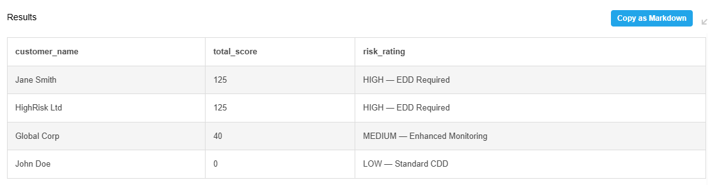

# KYC-Customer-Risk-Scoring

**1. Introduction**

In financial crime compliance, manual risk scoring often leads to inconsistent outcomes and "discretionary bias." This project addresses those vulnerabilities by codifying a **Risk-Based Approach (RBA)** directly into a technical framework. The model utilises **automated scoring logic** to evaluate customer profiles against fixed risk pillars, including **PEP status, Jurisdictional Risk,** and **Adverse Media.** By shifting the calculation from manual spreadsheets to a **SQL-driven engine,** the system ensures 100% computational consistency. This creates a reliable audit trail and ensures that **Enhanced Due Diligence (EDD)** triggers are based on objective data thresholds rather than subjective interpretation.

**2. Skills Demonstrated**

* **Domain Expertise:** Anti-Money Laundering (**AML**), Know Your Customer (**KYC**), Enhanced Due Diligence (**EDD**), PEP/Sanctions Screening.

* **Technical Skills:** **SQL** (Data Transformation & CASE logic), **Excel** (Conditional Formatting, **Nested IF Functions,** Data Validation).

* **Data Visualisation:** Designing executive-ready compliance reports.

**3. Key Features**

* **Automated Risk Tiering:** Instantly classifies customers into **High,** **Medium,** or **Low** risk.

* **Weighted Scoring Logic:** Not all risks are equal; this model weights "Country Risk" differently than "Product Risk."

* **EDD Trigger System:** Visual alerts (Red Flags) that notify the user when **Enhanced Due Diligence** is legally required.

* **Dynamic Dashboards:** Real-time recalculation of risk scores based on user input.

**4. Keyboard Shortcuts (Excel Utility)**

To speed up the investigative workflow within the tool:

* **Ctrl + Shift + L:** Quickly filter the risk output table.

* **Alt + A + C:** Clear all filters to see the full customer population.

* **F2:** Audit the underlying scoring formula in any cell.

**5. The Development Process**

* **Schema Design:** Defined the risk pillars (Geography, Customer Type, Product).

* **Logic Implementation:** Wrote CASE statements in SQL to assign numerical values to qualitative data.

* **Front-End Mapping:** Exported SQL results and built a VLOOKUP-driven dashboard in Excel for non-technical users.

 

**6. Professional Insights (What I Learned)**

* **Logic over Syntax:** While the SQL code is vital, the most important part was ensuring the logic aligned with global AML standards (FATF).

* **User-Centric Design:** I learned that data is useless if an investigator cannot interact with it; hence the need for the Excel UI.
